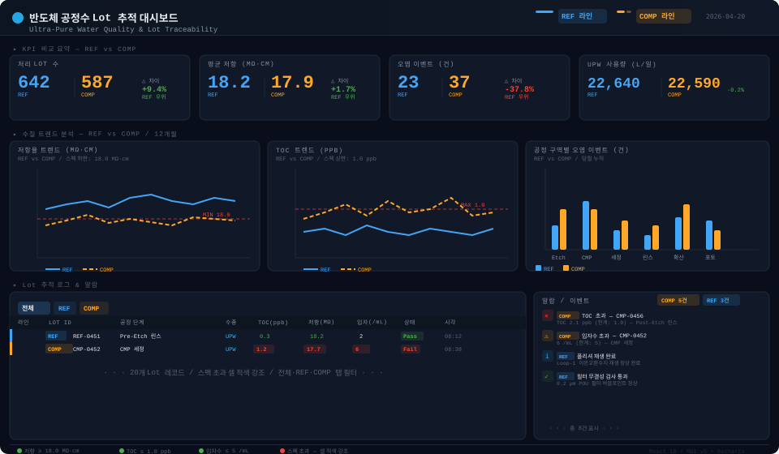

# 반도체 공정수 Lot 추적 대시보드

**Semiconductor Ultra-Pure Water Quality & Lot Traceability Dashboard**

> React 18 + MUI v5 기반 엔지니어링 대시보드.  
> 두 생산 라인(**REF** vs **COMP**)의 공정수 수질을 실시간 비교 분석합니다.



---

## 빠른 시작 (Quick Start)

```bash
git clone <repo-url>
cd vue-materia
npm install
npm run dev
```

브라우저에서 `http://localhost:5173` 접속 → 대시보드 바로 확인.

> **Node.js 18+** 필요. `package-lock.json` 포함되어 있으므로 `npm install` 만으로 동일한 의존성 설치 보장.

---

## 대시보드 구성

```
┌─────────────────────────────────────────────────────────────────────┐
│  Header: 라인 범례 (■ REF | ■ COMP)  +  현재 시각                  │
├─────────────┬─────────────┬─────────────┬──────────────────────────┤
│  처리 Lot수 │  평균 저항  │  오염 이벤트│  UPW 사용량              │
│  REF | COMP │  REF | COMP │  REF | COMP │  REF | COMP   △차이%    │
├─────────────┴──────┬──────┴─────────────┴──────────────────────────┤
│  저항율 트렌드      │  TOC 트렌드         │  공정구역별 오염 이벤트 │
│  (12개월, MΩ·cm)  │  (12개월, ppb)      │  (그룹 막대, 건)        │
│  REF ─── COMP ---  │  REF ─── COMP ---   │  REF ■  COMP ■          │
│  ─ ─ 스펙 하한선   │  ─ ─ 스펙 상한선    │                         │
├────────────────────┴─────────────────────┴──────────────────────────┤
│  Lot 추적 로그  [전체] [REF] [COMP]                                 │
│  라인 | Lot ID | 공정단계 | 수종 | TOC | 저항 | 입자수 | 상태 | 시각│
│  스펙 초과 셀 → 적색 강조                                           │
├──────────────────────────────────────────┬──────────────────────────┤
│  (Lot 테이블 계속)                        │  알람 / 이벤트           │
│                                          │  ● [COMP] TOC 초과       │
│                                          │  ⚠ [COMP] 입자수 초과   │
│                                          │  ✓ [REF]  필터 검사 통과 │
└──────────────────────────────────────────┴──────────────────────────┘
```

### 섹션별 설명

| 섹션 | 내용 |
|------|------|
| **KPI 카드** | REF / COMP 수치를 나란히 표시. 퍼센트 차이와 우위 라인 자동 계산 |
| **저항율 트렌드** | 12개월 일평균 MΩ·cm — 스펙 하한(18.0) 참조선 포함 |
| **TOC 트렌드** | 12개월 일평균 ppb — 스펙 상한(1.0) 참조선 포함 |
| **오염 이벤트** | 공정 구역(Etch / CMP / 세정 / 린스 / 확산 / 포토)별 그룹 막대 |
| **Lot 추적 테이블** | 전체·REF·COMP 탭 필터. TOC > 1.0 / 저항 < 18.0 / 입자수 > 5 → 셀 적색 강조 |
| **알람 패널** | 심각도(error / warning / info / success) + 라인 태그 이벤트 목록 |

---

## REF vs COMP 비교 설계

모든 시각화 요소에 일관된 색상 체계를 적용합니다.

| 구분 | 색상 | 적용 |
|------|------|------|
| **REF 라인** | `#42A5F5` (파란색) | KPI 수치, 차트 실선, 테이블 좌측 보더, 알람 칩 |
| **COMP 라인** | `#FFA726` (주황색) | KPI 수치, 차트 점선, 테이블 좌측 보더, 알람 칩 |
| **Pass** | `#4CAF50` (녹색) | 상태 칩 |
| **Fail / 초과** | `#F44336` (빨간색) | 상태 칩, 스펙 초과 셀 배경 |
| **진행중** | `#42A5F5` (파란색) | 상태 칩 |

---

## UPW 스펙 기준 (SEMI F57)

| 파라미터 | 단위 | 한계 | 비고 |
|----------|------|------|------|
| 저항율 | MΩ·cm | ≥ 18.0 | 미달 시 셀 적색 |
| TOC | ppb | ≤ 1.0 | 초과 시 셀 적색 |
| 입자수 (≥0.05 µm) | /mL | ≤ 5 | 초과 시 셀 적색 |
| 박테리아 | CFU/mL | ≤ 0.001 | |
| 실리카 (SiO₂) | ppb | ≤ 0.5 | |
| 용존 산소 | ppb | ≤ 100 | |

---

## 기술 스택

| 역할 | 라이브러리 | 버전 |
|------|-----------|------|
| UI 프레임워크 | React | 18.2 |
| 컴포넌트 라이브러리 | MUI (Material UI) | 5.x |
| 차트 | Recharts | 2.x |
| 라우팅 | React Router | 6.x |
| 빌드 도구 | Vite | 5.x |

---

## 프로젝트 구조

```
src/
├── main.jsx                    # React 진입점
├── App.jsx                     # 라우터 설정
├── theme.js                    # MUI 다크 테마 + REF/COMP 색상 정의
├── data/
│   └── mockData.js             # Lot 데이터, 알람, 차트 시계열, 스펙 상수
├── components/
│   ├── KpiCard.jsx             # REF/COMP 나란히 표시 + 차이% 계산
│   ├── WaterQualityChart.jsx   # 저항율·TOC 트렌드 (Recharts LineChart)
│   ├── ContaminationChart.jsx  # 공정구역별 오염 이벤트 (Recharts BarChart)
│   ├── AlarmPanel.jsx          # 심각도별 이벤트 목록
│   └── LotTraceTable.jsx       # 탭 필터 + 스펙 초과 셀 강조 테이블
└── pages/
    └── WaterDashboard.jsx      # 전체 레이아웃 조립
```

---

## 데이터 커스터마이징

실제 공정 데이터로 교체하려면 `src/data/mockData.js`를 수정합니다.

### Lot 데이터 구조

```js
export const lots = [
  {
    id: 'REF-0451',         // Lot ID
    line: 'REF',            // 'REF' | 'COMP'
    stage: 'Pre-Etch 린스', // 공정 단계명
    waterType: 'UPW',       // 'UPW' | 'DIW'
    toc: 0.3,               // ppb
    resistivity: 18.2,      // MΩ·cm
    particles: 2,           // /mL
    status: 'Pass',         // 'Pass' | 'Fail' | '진행중'
    timestamp: '04-20 08:12',
  },
];
```

### 스펙 한계 수정

```js
export const SPEC = {
  toc:         { max: 1.0,  unit: 'ppb',   label: 'TOC' },
  resistivity: { min: 18.0, unit: 'MΩ·cm', label: '저항' },
  particles:   { max: 5,    unit: '/mL',   label: '입자수' },
};
```

### KPI 항목 수정

```js
export const KPI = {
  lots: {
    label: '처리 Lot 수',
    unit: '',
    icon: 'inventory_2',
    REF: 642,
    COMP: 587,
    higherIsBetter: true,   // true → REF가 높으면 우위(녹색)
  },
  // ...
};
```

---

## 빌드 & 배포

```bash
# 프로덕션 빌드
npm run build
# dist/ 폴더 생성 — 정적 파일 서버 또는 Nginx로 서빙 가능

# 빌드 결과 로컬 미리보기
npm run preview
```

---

## 브랜치

| 브랜치 | 내용 |
|--------|------|
| `claude/semiconductor-water-dashboard-c8cWM` | 현재 개발 브랜치 |
| `main` | 원본 Vue Material Dashboard (참조용) |
